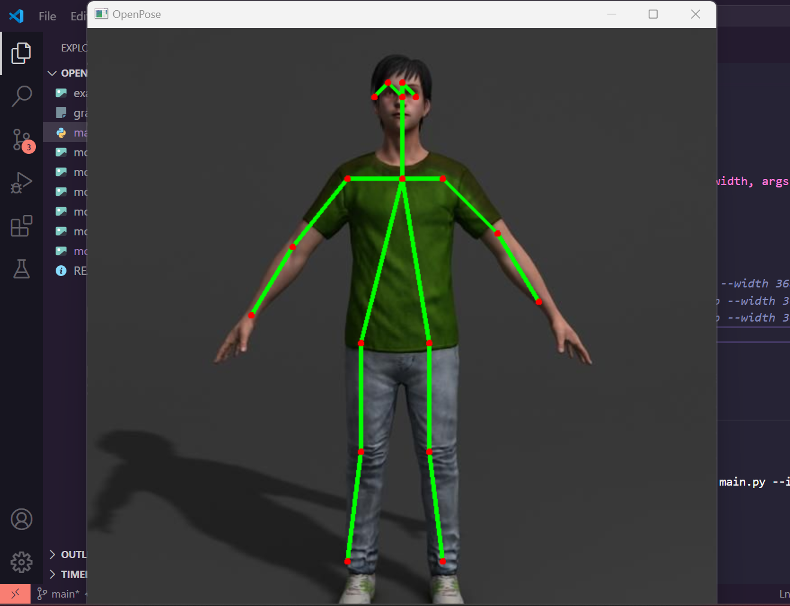
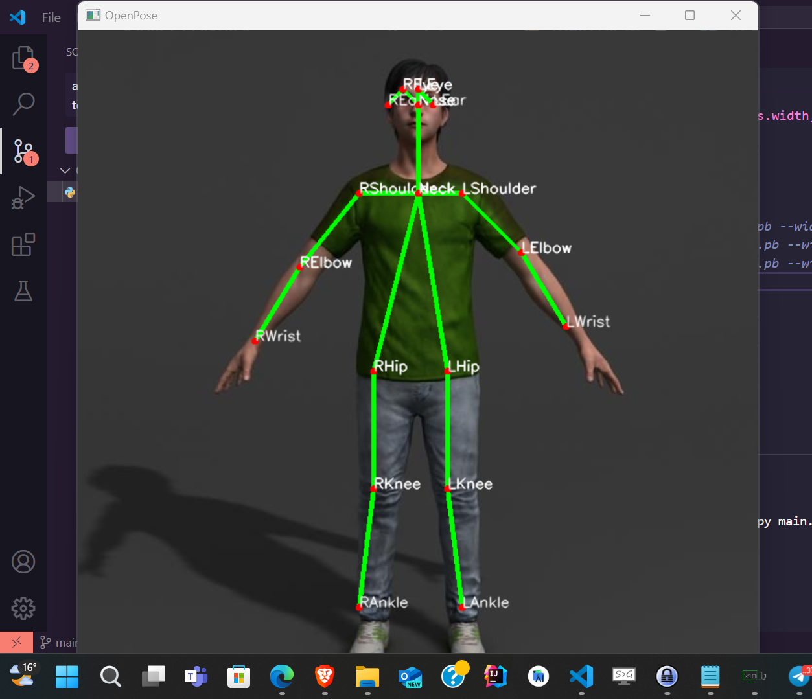
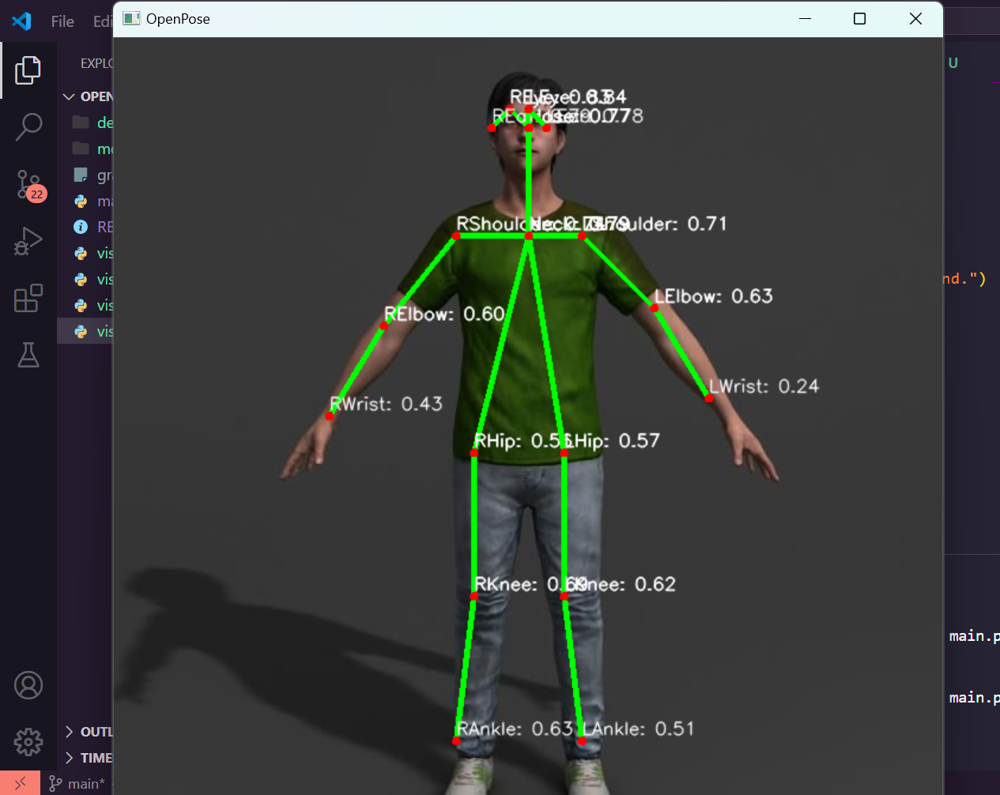
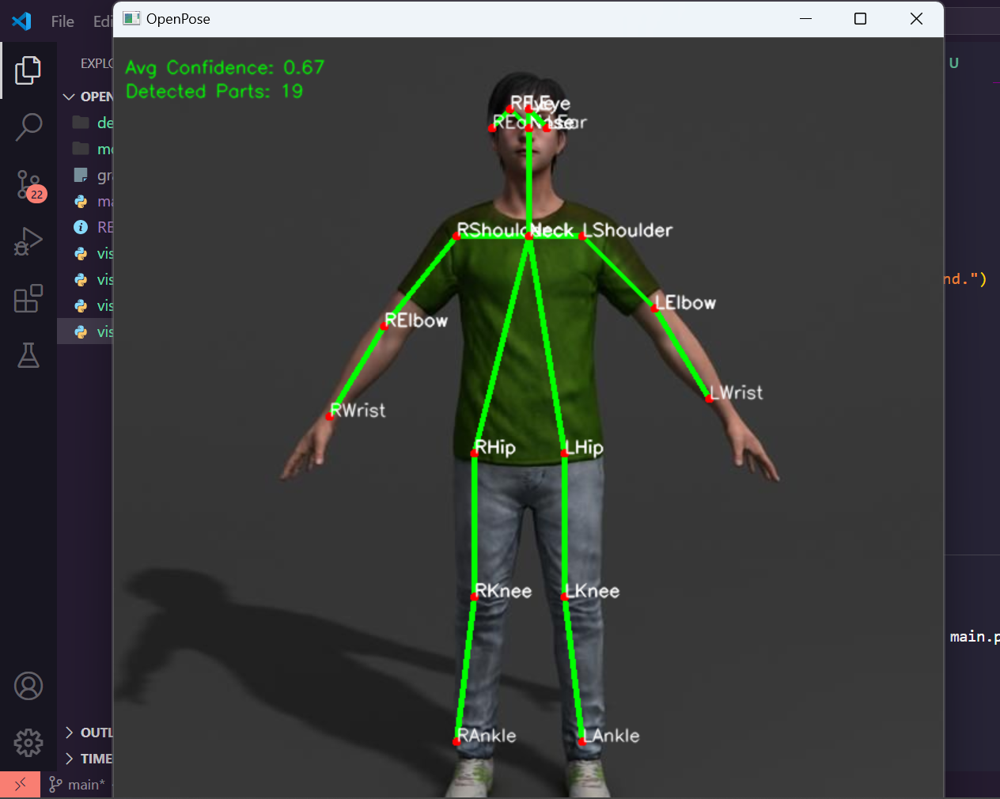

### Person's body parts or joint position detection using openCV

- Visualization 1 : Without body parts annotation




- Visualization 2 : With body parts annotation




- Visualization 3 : Body part confidence score




- Visualization 4 : Average confidence score and number of detected body parts




Example usage
```
py main.py visualization1 --input models/model6.jpg --model graph_opt.pb --width 368 --height 368 --thr 0.2
```